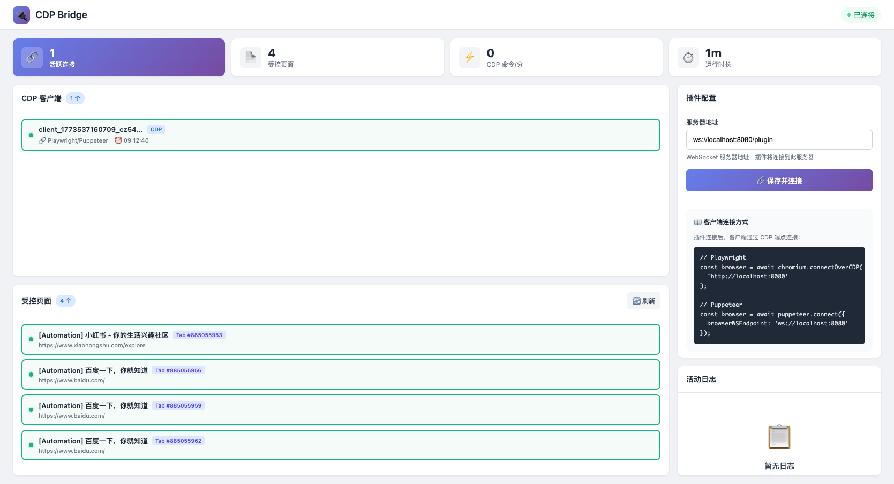

# CDP Tunnel

<p align="center">
  
</p>

<p align="center">
  <strong>Chrome DevTools Protocol Bridge</strong>
</p>

<p align="center">
  A Chrome extension that exposes your browser as a CDP endpoint,<br>
  supporting multiple Playwright/Puppeteer clients to connect simultaneously.
</p>

<p align="center">
  <a href="docs/README_CN.md">中文文档</a> | 
  <a href="https://github.com/dyyz1993/cdp-tunnel">GitHub</a>
</p>

<p align="center">
  
  
  
</p>

---

## Architecture

```
┌─────────────────────────────────────────────────────────────────┐
│                        Proxy Server                             │
│                     (localhost:9221)                            │
│                                                                 │
│   /plugin  ←─── Chrome Extension (WebSocket)                    │
│   HTTP     ←─── Playwright/Puppeteer Clients                    │
└─────────────────────────────────────────────────────────────────┘
         ↑              ↑              ↑
         │              │              │
    Client 1       Client 2       Client 3
   (clientId_1)    (clientId_2)    (clientId_3)
```

## Features

- **Multi-client Support** - Multiple Playwright/Puppeteer clients can connect simultaneously
- **Message Isolation** - Pages created by each client are owned by that client
- **Configuration Page** - Visualize connection status, client list, and controlled pages
- **Auto Reconnect** - Extension automatically reconnects to the server

## Screenshot



## Quick Start

### 1. Start the Proxy Server

```bash
cd server
npm install
node proxy-server.js
```

The server will start on `localhost:9221`.

### 2. Install Chrome Extension

1. Open `chrome://extensions/`
2. Enable "Developer mode"
3. Click "Load unpacked"
4. Select the `extension-new` directory

### 3. Connect the Extension

Click the extension icon, enter the server address in the configuration page, and click "Save and Connect".

### 4. Client Connection

```javascript
// Playwright
const { chromium } = require('playwright');

const browser = await chromium.connectOverCDP('http://localhost:9221');
const context = browser.contexts()[0];
const page = await context.newPage();
await page.goto('https://example.com');

// Puppeteer
const puppeteer = require('puppeteer');

const browser = await puppeteer.connect({
  browserWSEndpoint: 'ws://localhost:9221'
});
const page = await browser.newPage();
await page.goto('https://example.com');
```

## Multi-client Usage

All clients connect to the same endpoint `http://localhost:9221`. The server automatically assigns a unique `clientId` to each connection.

```javascript
// Multiple clients can connect simultaneously
const browser1 = await chromium.connectOverCDP('http://localhost:9221');
const browser2 = await chromium.connectOverCDP('http://localhost:9221');
const browser3 = await chromium.connectOverCDP('http://localhost:9221');

// Pages created by each client are independent
const page1 = await browser1.contexts()[0].newPage();
const page2 = await browser2.contexts()[0].newPage();
const page3 = await browser3.contexts()[0].newPage();
```

## Configuration Page

Click the extension icon to open the configuration page, where you can view:

- **CDP Client List** - Shows connected Playwright/Puppeteer clients
- **Controlled Pages List** - Shows controlled pages with click-to-navigate support
- **Activity Log** - Connection status change records

## Project Structure

```
cdp-tunnel/
├── server/
│   └── proxy-server.js      # Proxy server
├── extension-new/
│   ├── background.js        # Extension Service Worker
│   ├── config-page-preview.html  # Configuration page
│   ├── config-page.js       # Configuration page script
│   ├── core/
│   │   ├── state.js         # State management
│   │   └── websocket.js     # WebSocket connection management
│   └── features/
│       ├── cdp-router.js    # CDP message routing
│       └── screencast.js    # Screenshot functionality
└── tests/
    ├── playwright-single.js      # Single client test
    ├── playwright-multi.js       # Multi-client test
    └── playwright-interactive.js # Interactive test
```

## Testing

```bash
# Single client test
node tests/playwright-single.js

# Multi-client test
node tests/playwright-multi.js

# Interactive test
node tests/playwright-interactive.js
```

## Notes

1. **Port Availability** - Ensure port 9221 is not in use
2. **Extension Permissions** - The extension requires `debugger`, `tabs`, and other permissions
3. **Browser Limitation** - Only one extension can control a browser via debugger at a time

## License

This project is licensed under the Apache License 2.0 with Attribution Requirement.

See [LICENSE](LICENSE) for details.

---

If you use this project in your work, please include attribution:
- Project: CDP Tunnel
- Author: dyyz1993
- Source: https://github.com/dyyz1993/cdp-tunnel
